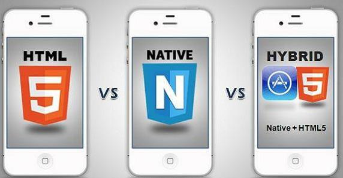
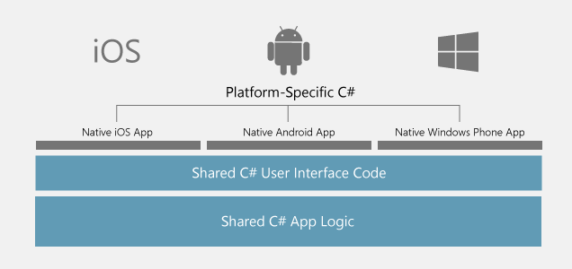

# Native Apps, Web Apps and Hybrid Apps

## Native App

### What's native apps

A native application (native app) is an application program that has been developed for use on a particular platform or device. Because native apps are written for a specific platform, they can interact with and take advantage of operating system features and other software that is typically installed on that platform.

### Advantages of Native Apps

1. Local applications execution is stunning, the stacking speed is additionally high and cell phone's battery utilization is likewise low.
2. Give you a chance to utilize gadget particular hand signals. Android and iOS are gradually creating distinctive traditions for connection, and a local application reacts the way its client anticipates.
3. Client can access to the majority of the gadget usefulness, for example, Bluetooth, NFC, and others.
4. It likewise permits anchoring the information in light of the capacity limit of your cell phone. May a times, the speed is significantly quicker as it stores data locally and just synchronize with the server after the client is finished utilizing the application.
5. Numerous mobile app development company in USA consider that it is more secure and sheltered as local applications require the endorsement of the application store they are expected for, which guarantees the enhanced wellbeing and security of the application.

### Disadvantages of Native Apps

1. One of the real drawbacks is with respect to the dissemination grinding - extreme to pull in new clients.
2. Local applications for both Android and iOS are produced on particular stages. You can't utilize Android codes for iOS and the other way around. What's more, in the event that you require application for both the stage, you have to employ diverse application designers for creating Android and iOS applications.
3. Truly costly to get outlined and manufacture, particularly when the application should be good with various versatile working frameworks, in this way duplicating the improvement costs.
4. Staggering expense for application upkeep particularly if this application bolsters in excess of one stage.
5. Getting the application endorsement from application stores is a long and dull process, likewise can't be overhauled effectively.

### How to develop native apps

Native apps are applications written in languages that the platform they are being built for accepts. For example, Swift or Objective-C is used to write native iOS apps, Java is used to write native Android apps, and C# for the most part for Windows Phone apps.
Apple and Google offer app developers their own development tools, interface elements and standardised SDK: Xcode and Android Studio. This allows any professional developer to develop a native app relatively easily.

The main disadvantage of native apps is having to develop apps separately for each platform you want to cover. That’s still true if you want to stick to the native SDKs provided by Apple and Google, but in the last few years, several alternatives have become available to reap the benefits of cross-platform development without sacrificing the user experience or access to native APIs. Two of such platforms that allow for cross-platform development are Xamarin and React Native.

Xamarin Made by Microsoft.
Xamarin is a platform that lets developers build one app that works on multiple platforms in C#. They also provide free tools to build, test, distribute, and learn from your apps.
React Native Not wanting to be left out of the fight, in 2015 Facebook launched an open-source project of their own called React Native, which lets you build real, native iOS and Android apps with one codebase.

## Reference

https://www.quora.com/What-is-a-mobile-native-app