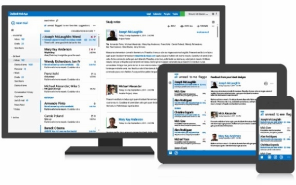

# Native Apps, Web Apps and Hybrid Apps

## Native App

### What's native apps

A native application (native app) is an application program that has been developed for use on a particular platform or device. Because native apps are written for a specific platform, they can interact with and take advantage of operating system features and other software that is typically installed on that platform.

### Advantages of Native Apps

1. ***Local applications execution is stunning, the stacking speed is additionally high and cell phone's battery utilization is likewise low.***
2. Give you a chance to utilize gadget particular hand signals. Android and iOS are gradually creating distinctive traditions for connection, and a local application reacts the way its client anticipates.
3. Client ***can access to the majority of the gadget usefulness***, for example, Bluetooth, NFC, and others.
4. It likewise permits anchoring the information in light of the capacity limit of your cell phone. May a times, the speed is significantly quicker as it stores data locally and just synchronize with the server after the client is finished utilizing the application.
5. Numerous mobile app development company in USA consider that it is ***more secure*** and sheltered as local applications require the endorsement of the application store they are expected for, which guarantees the enhanced wellbeing and security of the application.

### Disadvantages of Native Apps

1. One of the real drawbacks is with respect to the dissemination grinding - extreme to pull in new clients.
2. Local applications for both Android and iOS are produced on particular stages. **You can't utilize Android codes for iOS and the other way around.** What's more, in the event that you require application for both the stage, you have to employ diverse application designers for creating Android and iOS applications.
3. **Truly ***costly*** to get outlined and manufacture**, particularly when the application should be good with various versatile working frameworks, in this way duplicating the improvement costs.
4. Staggering expense for application upkeep particularly if this application bolsters in excess of one stage.
5. ***Getting the application endorsement from application stores is a long and dull process***, likewise can't be overhauled effectively.

### How to develop Native Apps

Native apps are applications written in languages that the platform they are being built for accepts. For example, **Swift** or **Objective-C** is used to write native iOS apps, **Java** is used to write native Android apps, and **C#** for the most part for Windows Phone apps.
Apple and Google offer app developers their own development tools, interface elements and standardised **SDK**: Xcode and Android Studio. This allows any professional developer to develop a native app relatively easily.

The main disadvantage of native apps is having to develop apps separately for each platform you want to cover. That’s still true if you want to stick to the native SDKs provided by Apple and Google, but in the last few years, several alternatives have become available to reap the benefits of cross-platform development without sacrificing the user experience or access to native APIs. Two of such platforms that allow for cross-platform development are Xamarin and React Native.

Xamarin Made by Microsoft.

Xamarin is a platform that lets developers build one app that works on multiple platforms in C#. They also provide free tools to build, test, distribute, and learn from your apps.
 

React Native

Not wanting to be left out of the fight, in 2015 Facebook launched an open-source project of their own called React Native, which lets you build real, native iOS and Android apps with one codebase.

## Web apps

### What's Web Apps

A web application or web app is any ***software that runs in a web browser.*** It is created in a browser-supported programming language (such as the combination of **JavaScript**, **HTML** and **CSS**) and relies on a web browser to render the application.
Web applications are popular due to the **ubiquity of web browsers**, and the convenience of using a web browser as a client, sometimes called a thin client. The ability to update and maintain web applications without distributing and installing software on potentially thousands of client computers is a key reason for their popularity, as is the inherent support for cross-platform compatibility. Common web applications include webmail, online retail sales, online auctions, wikis and many other functions.

### Advantages of Web Apps

1. **It can be cross-platform, and easy to debug.**
2. There is **no need to install** web apps, so that they do not occupy the phone memory.
3. Web apps have the fastest update speed because they can be upgraded by refreshing the page.
4. There is **no multi-version problem**(there is only one version for user), which leads to low maintenance costs
5. It is temporary entrance, can be arbitrarily embedded

### Disadvantages of Web Apps

1. Web apps rely on the network, the first time to visit the page is slow, and will consume volume.
2. Web apps' **performance is limited by mobile phone and browser performance**, the user experience compared to other modes is the worst.
3. Web apps' **function is limited**, the massive mobile functions cannot be realized
4. The entrance of Web Apps is strongly dependent on the third-party browser, and can only be in the form of a URL address, resulting in a low user retention rate (advantage is the disadvantage)

### How to develop Web Apps

The vast majority of Web Apps are built in JavaScript, CSS, and HTML5.
Unlike an iOS or Android app, ***there is no software development kit (SDK)*** for a developer to work with.
There are templates and frameworks like ***Angular***, ***React***, and ***Vue.js*** that you can use to get a quick start.

**Progressive Web App(PWA)**

Until recently, web apps lacked the functionality of native apps, like the ability to send push notifications, work offline, and load on the home screen.
However, there have been a few improvements to browsers and web apps that offer these features. Apps that take advantage of these features are called Progressive Web Apps (PWAs).

## Hybrid apps

 
Taobao is a hybrid app

### What's Hybrid Apps

If a native app and a web app got married and had a kid, it would be a hybrid app.
You **install it like a native app**, but it’s actually **a web app on the inside**.
Hybrid apps, like web apps, are built with Javascript, HTML, and CSS and run in something called Webview, ***a simplified browser within your app***.

### Advantages of Hybrid Apps

1. **One codebase to manage**: All the advantages of hybrid apps stem from the fact that, instead of building two apps, you’re building one app and simply tweaking it a bit so it works on both platforms.With a hybrid app, you only have one codebase to manage.
2. **You save time and money**: As you only have to manage one codebase, you’ll probably require half the number of developers two native apps would have required. Or, with the same number of developers, a hybrid app could be published in half the time. In addition, hybrid app developers are often less expensive than native app developers.
3. **Easier to scale**: Hybrid apps are easier to scale to another platform. Once you’ve built for one platform, you can launch on another like Windows Mobile.
4. **You still have access to device features**: As with native apps, hybrid apps let you retain the same ability to access device features.This is thanks to solutions like PhoneGap that act like a bridge between the native SDK and the webview in which the app runs.

### Disadvantages of Hybrid Apps

1. **Performance**: Performance is probably the biggest disadvantage of hybrid apps. Because hybrid apps load in a browser-like component called webview, they are only as good as the webview. Webview is responsible for displaying the UI and for running Javascript code. In the early days of mobile, Google and Apple didn’t give webview the same engines used by their mobile browsers, Chrome and Safari. Since then, webview has vastly improved but it hasn’t reached native performance yet. We will get deeper into different aspects of performance later in the article.
2. **Cross-platform development is tough**: Getting your hybrid app to run appropriately on each platform generally takes substantial work. In some situations, the total cost might become comparable to that of fully native apps, rendering the cost benefits negligible. It all depends on how close you want to get to the “native user experience” or how simple your app is.
3. **The UX of the app will suffer**: iOS and Android users tend to be very loyal to their platforms, and since they’ve been using them for years, they’re used to how things work in native apps. The differences are subtle but can be frustrating for your app users. By building a hybrid app, you won’t be able to please both camps. Try too hard to customize the app based on the platform and it may end up costing the same as two native apps.

### How to develop Hybrid Apps

The current mainstream platform for Hybrid app Development including Phonegap,appcan,appmobi and titanium. They are based on WebKit open source Core, developed with HTML5 standard. They are esay to adapt for diffierent models, supporting developer Custom plugin. And they can be well used in business, education, entertainment and other industries. They are preferred development platform for mobile developers.

## Reference

1. [What is a mobile native app?](https://www.quora.com/What-is-a-mobile-native-app)
1. [What is a Hybrid Mobile App?](https://developer.telerik.com/featured/what-is-a-hybrid-mobile-app/)
1. ["Native, HTML5, or Hybrid: Understanding Your Mobile Application Development Options"](https://developer.salesforce.com/page/Native,_HTML5,_or_Hybrid:_Understanding_Your_Mobile_Application_Development_Options)
1. [A Guide to Mobile App Development: Web vs. Native vs. Hybrid](https://clearbridgemobile.com/mobile-app-development-native-vs-web-vs-hybrid/)
1. [Mobile App Vs. Mobile Website: Which Is The Better Option?](https://clearbridgemobile.com/mobile-app-vs-mobile-website-which-is-the-better-option/)
1. [Web application - Wikipedia](https://en.wikipedia.org/wiki/Web_application)
1. [Native Apps, Web Apps or Hybrid Apps? What’s the Difference?](https://www.mobiloud.com/blog/native-web-or-hybrid-apps/)
